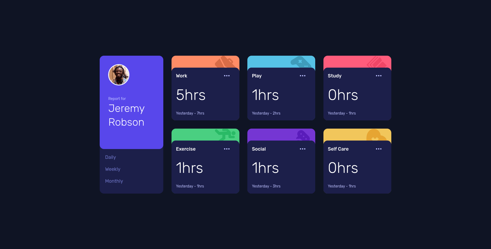

# Frontend Mentor - Time tracking dashboard solution

This is a solution to the [Time tracking dashboard challenge on Frontend Mentor](https://www.frontendmentor.io/challenges/time-tracking-dashboard-UIQ7167Jw). Frontend Mentor challenges help you improve your coding skills by building realistic projects.

## Table of contents

- [Overview](#overview)
  - [The challenge](#the-challenge)
  - [Screenshot](#screenshot)
  - [Links](#links)
- [My process](#my-process)
  - [Built with](#built-with)
  - [Useful resources](#useful-resources)
- [Author](#author)
- [Acknowledgments](#acknowledgments)

## Overview

### The challenge

Users should be able to:

- View the optimal layout for the site depending on their device's screen size
- See hover states for all interactive elements on the page
- Switch between viewing Daily, Weekly, and Monthly stats

### Screenshot

### Links

- Solution URL: [frontendmentor.io](https://www.frontendmentor.io/solutions/time-tracking-dashboard-with-react-and-hooks-for-datajson-5GDO9mQB9)
- Live Site URL: [whoamihealay.github.io/time-tracking-dashboard/](https://whoamihealay.github.io/time-tracking-dashboard/)

## My process

### Built with

- Semantic HTML5 markup
- CSS custom properties
- Flexbox
- CSS Grid
- Mobile-first workflow
- [React](https://reactjs.org/) - JS library

### Useful resources

- [React Docs](https://reactjs.org/docs/getting-started.html) - The docs for React are solid,I mainly used them to look up the new hooks! Reading the framework/library docs is my go-to and has never failed me! Definite recommend!
- [Fireship.io](https://www.youtube.com/c/Fireship) - Awesome Youtube channel. Fireship.io has a "Concept/framework in 100sec" playlist to quickly learn the very basics of a Programming language, framework, or concept. There are also longer videos for more in-depth frontend mini-projects (CSS grid, flex...)
- [Brad Taversy](https://www.youtube.com/c/TraversyMedia) - Awesome Youtube Channel and Udemy course on react and the Context library. I followed his React Crash Course and Udemy course on React. His implementation of Context is what I used and I feel very comfortable with it. It has a redux feel and I love it!
- [Kevin Powell](https://www.youtube.com/kepowob) - Discovered on FrontendMentor with the partnership on the Space challenge and where my CSS game step up to all new level (Have a look at my other challenges to see the differences)
- [Google](google.com) - Last but not least, the ultimate bug solver!

## Author

- Website - [whoamihealay](https://whoamihealay.com/)
- Frontend Mentor - [@whoamihealay](https://www.frontendmentor.io/profile/whoamihealay)
- Linkedin - [@andrewsouthern01](https://www.linkedin.com/in/andrewsouthern01/)

## Acknowledgments

A huge thank you to my wife Andrea for her unconditional support and love. To my parents the MVP's of my upbringing!
